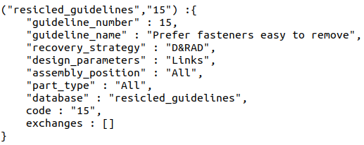
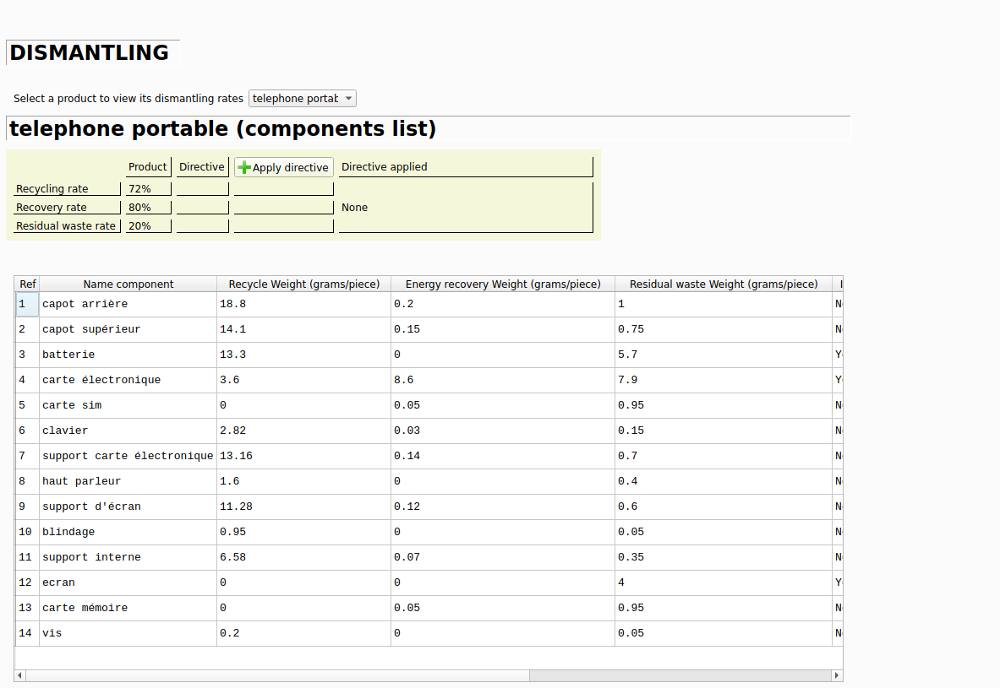
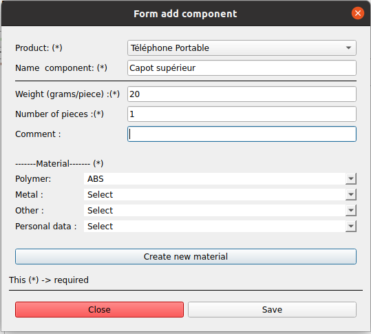

\maketitle
\begin{center}
\includegraphics{images/logo_resicled_transparent.png}
\end{center}
\thispagestyle{empty}
\clearpage
\tableofcontents
\pagenumbering{roman}
\clearpage
\pagenumbering{arabic}
\setcounter{page}{1}

## Présentation du plugin :

ReSICLED est historiquement un logiciel d'analyse environnementale axé sur l'étude des scénarios de recyclage dans le cadre de la conception d'un produit. Ce logiciel, à partir des informations rentrées par l'utilisateur, c'est-à-dire les différentes caractéristiques (poids, matériau, nombre) des composants contenus dans le produit, va produire différents scénarios de recyclage qui vont permettre de dire si le scénario personalisé conçu par l'utilisateur respecte la Directive Européenne, et donc si le produit a correctement été conçu. 

Dans notre cas, cette documentation technique est axée sur le portage de ce logiciel sous la forme d'un plugin pour un autre logiciel d'analyse environnementale, Activity Browser. Ainsi, nous allons voir comment ont été implémentés les principales fonctionnalités du plugin, à savoir la gestion des données, les calculs effectués sur les données, et l'implémentation graphique au sein de Activity Browser.

## Arborescence : 

Le plugin a été conçu de manière a séparer les différentes grandes parties du code : d'un côté, nous avons tout ce qui touche à l'API, c'est à dire la gestion des bases de données, calcul et formattage des données. Toutes les classes python concernant l'API se trouvent dans les sous-dossiers databases et models du plugin. De l'autre côté, pour ce qui touche à la partie interface graphique et interactions entre le plugin et l'utilisateur, les classes correspondantes sont situées dans les sous-dossiers views et layouts. Enfin, on retrouve les dossiers contenant des classes et des données utilitaires : dans notre cas, les données sont situées dans le dossier Include, et les classes utilitaires dans le sous-dossier tools.

## Gestion des données :

La partie analyse environnementale de Activity Browser, et notamment la partie API, est permise par la bibliothèque Python dénommée Brightway. Cette bibliothèque permet de créer des projets, dans lesquels on peut créer différentes bases de données et effectuer des calculs sur ces différentes données (Activity Browser n'est en fait que l'interface graphique de Brightway). De ce fait, on utilisera ce système de stockage de données pour réaliser le stockage des données propres à ReSICLED.

Le système de gestion de données de Brightway possède plusieurs avantages :  
    - Les données sont stockées en dur, sous la forme de fichiers JSON ou BW2Package. Ceci nous permet alors de pouvoir permettre une conservation des données du plugin en permanence, sans avoir à implémenter une fonction d'écriture en dur.  
    - On peut accéder aux données très facilement, du fait que le stockage des données peut s'identifier à celui d'un dictionnaire python. On peut alors créer des entrées personnalisées dans les bases de données qu'on crée, et donc dépasser le simple cadre de l'ACV de Brightway.  
    - L'import de bases de données pré-existantes est très simple : à condition que le fichier soit bien formatté ou dans la bonne extenstion, il est possible de créer une base de donnée contenant déjà des entrées de manière très simple (ce qui permet de pouvoir initialiser des données d'une manière très simple).  

A la suite d'une analyse approfondie du logiciel pré existant, on aboutit à un modèle physique de données (MPD), qu'on implémente par la suite via un système de classes Python manipulant des bases de donnée Brightway. [Voir annexe 1 pour le MPD, annexe 2 pour la structure des bdd bw].
Pour certaines des classes, nous avons dû initialiser les bases de données avec certaines informations à l'intérieur, notamment les matériaux, afin de permettre le bon fonctionnement du plugin. Nous avons alors tiré partie de la fonctionnalité d'import de bases de données préexistantes, en créant 3 fichiers bw2package contenant les 3 bases de données à initialiser lors de l'import du plugin.
De plus, chaque classe est munie de méthodes permettant de faciliter l'accès et la manipulation de ces données (méthodes d'accès à 1 entrée ou à toutes les entrées, méthode d'ajout ou de suppression).  
  
Voici comment se présente une entrée dans une base de données Brightway :  
  
*Exemple d'entrée dans la base de données resicled_guidelines*  
  
Ici, nous remarquons que nous avons pu ajouter plusieurs champs personnalisés à la base de données (comme la description de la directive). Cependant, afin de permettre la conservation des champs, il n'est pas possible d'utiliser la méthode d'ajout d'activité standard de Activity Browser : pour conserver nos données, il faut nécessairement charger le dictionnaire de la base de données, afin d'ajouter une nouvelle entrée, et d'écraser le contenu de la base de données en écrivant le dictionnaire incrémenté.

## Calculs et formattage des données :

L'une des autres grandes parties du plugin consiste en la réalisation des différents calculs nécessaires à l'établissement des scénarii. Dans le cadre de ReSICLED, les calculs et  résultats sont affichés sous forme de tableaux : nosu avons donc besoin de faire les calculs, puis de formatter les données pour rendre l'affichage des tableaux et leur utilisation beaucoup plus facile. Nous avons alors implémenté une classe appelée Datamodel, qui va faire les deux étapes. Cette classe implémente alors des méthodes pour obtenir les données dont nous avons besoin, effectuer les calculs nécéssaires, puis formatter les données pour qu'ensuite leur affichage soit le plus simple possible. Pour chaque tableau présent dans le plugin, nous avons implémenté sa propre méthode de formattage dans la classe Datamodel. Si l'on prend l'exemple du tableau du scénario Dismantling, la méthode associée va alors faire ce qui suit :
 - Récupérer les informations des composants du produit sélectionné;
 - Identifier les données intéressantes (ici le nom du composant, son identifiant, son poids, et les taux de recyclage du scénario correspondant)
 - Pour chacun des composants, on effectue les calculs nécéssaires (ici calcul des masses recyclées, de récupération énergétique et de déchets résiduels), puis on ajoute les données à la liste des données formattées les données (sour la forme d'un tuple)
 - Une fois tous les composants ajoutés, on trie la liste selon le numéro d'identifiant, afin de conserver l'ordre d'ajout des composants et de permettre d'aider l'utilisateur à identifier les pièces.
 - On retourne la liste des tuples (contenant les calculs effectués et les données formattées)

Une fois ceci fait, tout ce qui a trait à la manipulation des données en elles-mêmes est terminé, il ne nous reste plus qu'à rendre les données formattées lisibles et faciles à comprendre.

## Affichage dans Activity Browser

Comme évoqué brièvement précédemment, le système de plugins développé pour Activity Browser permet l'ajout d'onglets pour permettre aux plugins de disposer d'une interface graphique. C'est donc dans l'onglet généré par Activity Browser que nous allons générer l'interface graphique du plugin.
Activity Browser étant développé sur la base de la bibliothèque graphique PySide2 (portage de la bibliothèque graphique Qt de C++ en Python), il nous faut alors développer l'interface du plugin en utilisant cette bibliothèque.
Tout d'abord, pour ce qui est de l'aspect principal du plugin, nous avons décidé de garder une présentation similaire à celle que proposait la version originelle de ReSICLED, c'est-à-dire utiliser un système d'onglets pour garder le côté feuilles de Excel. De même, dans chacun de ces onglets, nous remettons les mêmes éléments contenus dans les feuilles du Excel : on implémente  les tableaux, boutons, menus déroulants, panneaux de présentation dans les onglets correspondants.

Cette implémentation passe alors par des classes, chacune se chargeant de gérer un onglet et ses interactions. Par exemple, pour l'onglet Dismantling :
La classe qui gère l'affichage de l'onglet va s'occuper d'afficher les éléments de changement de produit (menu déroulant), le panel de comparaison des taux de récupération à la directive sélectionnée, ainsi que le tableau. La classe implémente également les méthodes qui mettent à jour les éléments qui sont appelées lorsqu'on récupère les interactions entre l'application et l'utilisateur via les signaux PySide.  


  
*Exemple d'affichage d'onglet généré par une classe de l'IG*  


De même, le plugin fait appel à des fenêtres contextuelles afin d'ajouter des données ou de faire choisir à l'utilisateur des données (directives notamment). Pour ce faire, on fait appel à des fenêtres contextuelles qui vont permettre à l'utilisateur depouvoir interragir avec le plugin (pour créer un nouveau produit/composant/matériau, choisir la directive). Toutes ces fenêtres contextuelles sont gérées de la même façon, via une classe qui génère la fenêtre, et se charge de gérer les interactions avec l'utilisateur (notamment la sauvegarde des données quand on valide). Toutes les classes gérant les fenêtres de dialogue sont situées dans le même fichier ```form.py``` situé dans le sous-dossier views du plugin.

  
*Exemple fenêtre contextuelle*  

Enfin, la gestion globale des onglets du plugin est confiée au sous-dossier layouts, qui va contenir les classes qui implémentent le design des onglets de Activity Browser attribués au plugin et la gestion globale des onglets du plugin (par exemple, la classe rightTab va appeler ResicledTab, classe qui permet de mettre en place les différents onglets nécessaires).


# Annexes :

## Modèle physique de données 

  
